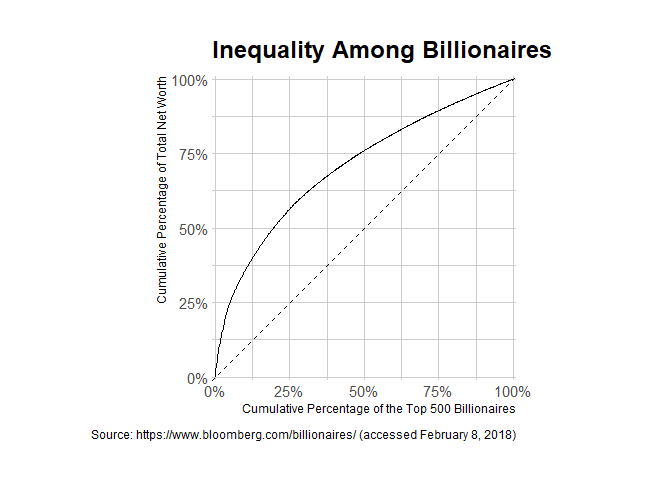
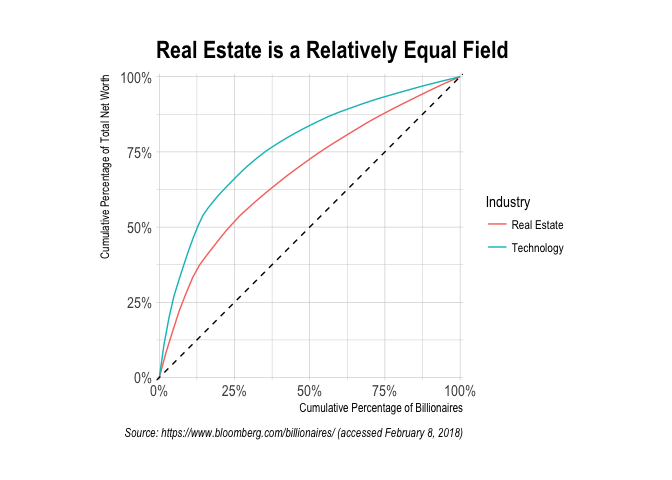
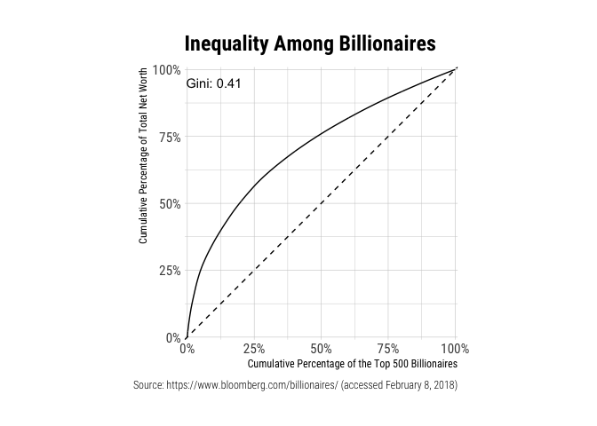
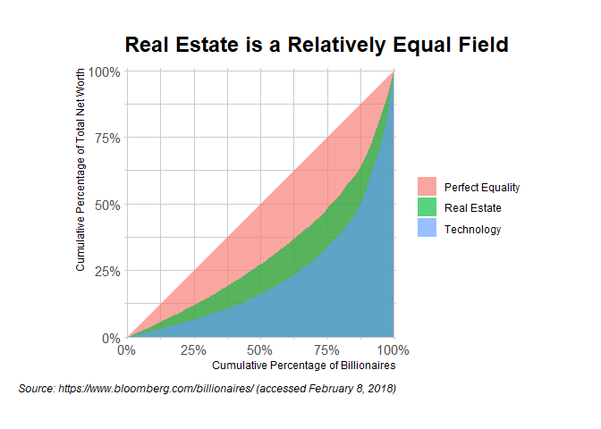
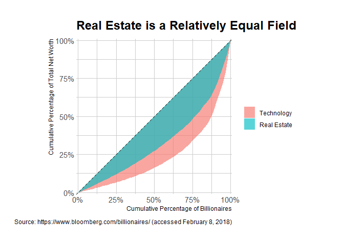

<!-- README.md is generated from README.Rmd. Please edit that file -->

[](https://travis-ci.org/jjchern/gglorenz)
[](https://ci.appveyor.com/project/jjchern/gglorenz)

# About `gglorenz`

The goal of `gglorenz` is to plot Lorenz Curves with the blessing of
`ggplot2`.

# Installation

``` r
# Install the CRAN version
install.packages("gglorenz")

# Install the development version from GitHub:
# install.packages("remotes")
remotes::install_github("jjchern/gglorenz")
```

# Example

Suppose you have a vector with each element representing the amount of
income or wealth a person produced, and you are interested in knowing
how much of that is produced by the top x% of the population, then the
`gglorenz::stat_lorenz(desc = TRUE)` would make a ggplot2 graph for you.

``` r
library(tidyverse)
#> ── Attaching packages ─────────────────────────────────────────────────────────────────────── tidyverse 1.2.1 ──
#> ✓ ggplot2 3.3.0          ✓ purrr   0.3.3.9000
#> ✓ tibble  3.0.1          ✓ dplyr   0.8.3     
#> ✓ tidyr   0.8.3          ✓ stringr 1.4.0     
#> ✓ readr   1.3.1          ✓ forcats 0.4.0
#> ── Conflicts ────────────────────────────────────────────────────────────────────────── tidyverse_conflicts() ──
#> x dplyr::filter() masks stats::filter()
#> x dplyr::lag()    masks stats::lag()
library(gglorenz)

billionaires
#> # A tibble: 500 x 6
#>    Rank  Name            Total_Net_Worth Country       Industry      TNW
#>    <chr> <chr>           <chr>           <chr>         <chr>       <dbl>
#>  1 1     Jeff Bezos      $118B           United States Technology  118  
#>  2 2     Bill Gates      $91.3B          United States Technology   91.3
#>  3 3     Warren Buffett  $86.1B          United States Diversified  86.1
#>  4 4     Mark Zuckerberg $74.3B          United States Technology   74.3
#>  5 5     Amancio Ortega  $71.7B          Spain         Retail       71.7
#>  6 6     Bernard Arnault $65.0B          France        Consumer     65  
#>  7 7     Carlos Slim     $64.7B          Mexico        Diversified  64.7
#>  8 8     Larry Ellison   $54.7B          United States Technology   54.7
#>  9 9     Larry Page      $52.6B          United States Technology   52.6
#> 10 10    Sergey Brin     $51.2B          United States Technology   51.2
#> # … with 490 more rows

billionaires %>%
    ggplot(aes(TNW)) +
    stat_lorenz(desc = TRUE) +
    coord_fixed() +
    geom_abline(linetype = "dashed") +
    theme_minimal() +
    hrbrthemes::scale_x_percent() +
    hrbrthemes::scale_y_percent() +
    hrbrthemes::theme_ipsum_rc() +
    labs(x = "Cumulative Percentage of the Top 500 Billionaires",
         y = "Cumulative Percentage of Total Net Worth",
         title = "Inequality Among Billionaires",
         caption = "Source: https://www.bloomberg.com/billionaires/ (accessed February 8, 2018)")
```



``` r

billionaires %>%
    filter(Industry %in% c("Technology", "Real Estate")) %>%
    ggplot(aes(x = TNW, colour = Industry)) +
    stat_lorenz(desc = TRUE) +
    coord_fixed() +
    geom_abline(linetype = "dashed") +
    theme_minimal() +
    hrbrthemes::scale_x_percent() +
    hrbrthemes::scale_y_percent() +
    hrbrthemes::theme_ipsum_rc() +
    labs(x = "Cumulative Percentage of Billionaires",
         y = "Cumulative Percentage of Total Net Worth",
         title = "Real Estate is a Relatively Equal Field",
         caption = "Source: https://www.bloomberg.com/billionaires/ (accessed February 8, 2018)")
```



The `annotate_ineq()` function allows you to label the chart with
inequality statistics such as the Gini coefficient:

``` r
billionaires %>%
    ggplot(aes(TNW)) +
    stat_lorenz(desc = TRUE) +
    coord_fixed() +
    geom_abline(linetype = "dashed") +
    theme_minimal() +
    hrbrthemes::scale_x_percent() +
    hrbrthemes::scale_y_percent() +
    hrbrthemes::theme_ipsum_rc() +
    labs(x = "Cumulative Percentage of the Top 500 Billionaires",
         y = "Cumulative Percentage of Total Net Worth",
         title = "Inequality Among Billionaires",
         caption = "Source: https://www.bloomberg.com/billionaires/ (accessed February 8, 2018)") +
    annotate_ineq(billionaires$TNW)
```



You can also use other geoms such as `area` or `polygon` and arranging
population in ascending order:

``` r
billionaires %>%
    filter(Industry %in% c("Technology", "Real Estate")) %>% 
    add_row(Industry = "Perfect Equality", TNW = 1) %>% 
    ggplot(aes(x = TNW, fill = Industry)) +
    stat_lorenz(geom = "area", alpha = 0.65) +
    coord_fixed() +
    hrbrthemes::scale_x_percent() +
    hrbrthemes::scale_y_percent() +
    hrbrthemes::theme_ipsum_rc() +
    theme(legend.title = element_blank()) +
    labs(x = "Cumulative Percentage of Billionaires",
         y = "Cumulative Percentage of Total Net Worth",
         title = "Real Estate is a Relatively Equal Field",
         caption = "Source: https://www.bloomberg.com/billionaires/ (accessed February 8, 2018)")
```



``` r

billionaires %>%
    filter(Industry %in% c("Technology", "Real Estate")) %>% 
    mutate(Industry = forcats::as_factor(Industry)) %>% 
    ggplot(aes(x = TNW, fill = Industry)) +
    stat_lorenz(geom = "polygon", alpha = 0.65) +
    geom_abline(linetype = "dashed") +
    coord_fixed() +
    hrbrthemes::scale_x_percent() +
    hrbrthemes::scale_y_percent() +
    hrbrthemes::theme_ipsum_rc() +
    theme(legend.title = element_blank()) +
    labs(x = "Cumulative Percentage of Billionaires",
         y = "Cumulative Percentage of Total Net Worth",
         title = "Real Estate is a Relatively Equal Field",
         caption = "Source: https://www.bloomberg.com/billionaires/ (accessed February 8, 2018)")
```



# Acknowledgement

The package came to exist solely because Bob Rudis was [generous
enough](https://github.com/hrbrmstr/ggalt/issues/46) to write a chapter
that [demystifies
`ggplot2`.](https://rud.is/books/creating-ggplot2-extensions/demystifying-ggplot2.html)
